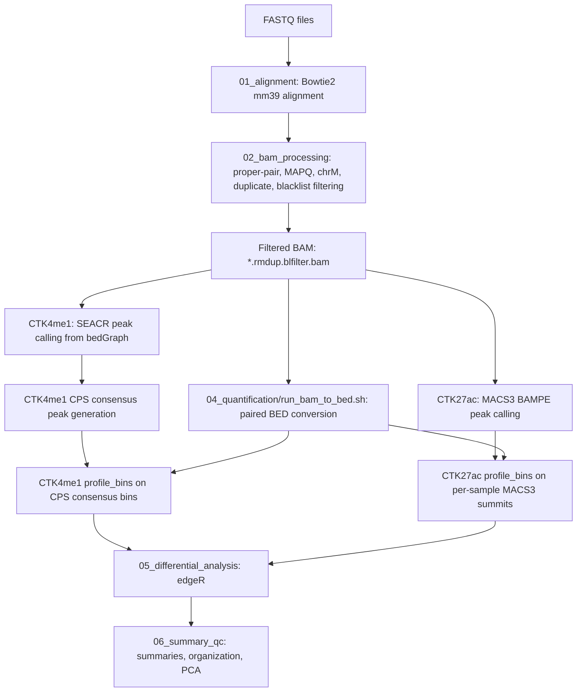

# Sean Li CUT&Tag Analysis Workflow

This repository contains the current maintained CUT&Tag analysis scripts for the Sean Li project under the mm39 reference framework.

The code in this repository is the source of truth for the current workflow. The active implementation uses:

- Bowtie2 and samtools for alignment
- Picard, samtools, and bedtools for BAM filtering and duplicate removal
- SEACR for CTK4me1 peak calling
- MACS3 for CTK27ac peak calling
- `profile_bins` for peak/bin-level read quantification
- edgeR for differential enrichment analysis
- ChIPseeker for peak annotation
- edgeR-normalized PCA for sample-level QC

Most scripts are written for SLURM execution on the Cedars-Sinai HPC environment and point to the project root:

```bash
/common/lix5lab/Li_Xue_Cut_Tag_06162022/Analysis_WYZ/mm39
```

## Repository Layout

```text
script/
├── config/
│   └── project_config.sh
├── metadata_form/
│   ├── Metadata_Comparison.csv
│   ├── Metadata_CTK4me1_Comparison.csv
│   └── Metadata_CTK27ac_Comparison.csv
├── reference/
│   ├── mm39.excluderanges.bed
│   └── mm10.Boyle.mm10-Excludable.v2.bed
├── 01_alignment/
├── 02_bam_processing/
├── 03_peak_calling/
├── 04_quantification/
├── 05_differential_analysis/
└── 06_summary_qc/
```

## Current Analysis Scope

The current maintained script branches cover:

- CTK4me1
- CTK27ac

The active comparison metadata used by most scripts is:

```text
metadata_form/Metadata_Comparison.csv
```

Marker-specific metadata files are also kept in `metadata_form/` as reference or branch-specific inputs:

- `Metadata_CTK4me1_Comparison.csv`
- `Metadata_CTK27ac_Comparison.csv`

At the time this README was written, the checked-in `Metadata_Comparison.csv` contains CTK4me1 comparisons. CTK27ac scripts also read `Metadata_Comparison.csv` in the current code, so CTK27ac runs require CTK27ac rows to be present in that active metadata file, or the script paths should be adjusted to use `Metadata_CTK27ac_Comparison.csv`.

## Workflow Overview



## Stage 1: Alignment

Directory:

```text
01_alignment/
```

Main scripts:

- `submit_alignment.sh`
- `run_alignment.sh`

The alignment stage reads paired FASTQ files from:

```bash
${PROJECT_ROOT}/trim_fastqs
```

Expected FASTQ naming:

```text
<SAMPLE_ID>_R1.fastq.gz
<SAMPLE_ID>_R2.fastq.gz
```

Alignment is performed with Bowtie2 against the mm39 genome index configured in `config/project_config.sh`:

```bash
GENOME_REF="/common/lix5lab/reference/Mus_musculus/GENCODE/mm39/Bowtie2Index/GRCm39"
```

Output BAMs are written to:

```bash
${PROJECT_ROOT}/bam/<SAMPLE_ID>.coordsorted.bam
```

An optional spike-in alignment branch is available:

- `submit_alignment_spikein.sh`
- `run_alignment_spikein.sh`

This branch aligns reads to Amp/pBlueScript and E. coli spike-in references and writes BAMs under:

```bash
${PROJECT_ROOT}/bam_spike
```

## Stage 2: BAM Processing

Directory:

```text
02_bam_processing/
```

Main scripts:

- `submit_process_bam.sh`
- `run_process_bam.sh`

This stage starts from:

```text
*.coordsorted.bam
```

and produces:

```text
*.rmdup.blfilter.bam
```

Processing steps:

1. Keep properly paired reads.
2. Apply minimum MAPQ from `MAPQ_MIN` in `project_config.sh`.
3. Remove chrM.
4. Remove duplicates using Picard `MarkDuplicates`.
5. Remove reads overlapping the mm39 blacklist:

```text
reference/mm39.excluderanges.bed
```

The final BAM for downstream peak calling and quantification is:

```text
${PROJECT_ROOT}/bam/<SAMPLE_ID>.rmdup.blfilter.bam
```

QC outputs are written under:

```bash
${PROJECT_ROOT}/qc
```

## Stage 3: Peak Calling

Directory:

```text
03_peak_calling/
```

### CTK4me1: SEACR

Directory:

```text
03_peak_calling/CTK4me1/
```

Main scripts:

- `submit_seacr_callpeak_CTK4me1.sh`
- `run_seacr_peak_calling_CTK4me1.sh`
- `run_cps_generation.sh`

The CTK4me1 branch expects SEACR-ready bedGraph files in:

```bash
${PROJECT_ROOT}/seacr_bedgraph/CTK4me1
```

Expected input pattern:

```text
*.seacr.bedgraph
```

SEACR parameters are controlled in `config/project_config.sh`:

```bash
SEACR_THRESHOLD="0.01"
SEACR_MODE="stringent"
```

SEACR peak outputs are written to:

```bash
${PROJECT_ROOT}/seacr_peak_calling/CTK4me1
```

After SEACR peak calling, `run_cps_generation.sh` creates metadata-driven CPS consensus peak sets by merging peak files for all sample groups used by each CPS comparison.

Consensus peak outputs:

```bash
${PROJECT_ROOT}/consensus_peaks/CTK4me1/<CPS>_consensus.bed
```

### CTK27ac: MACS3

Directory:

```text
03_peak_calling/CTK27ac/
```

Main scripts:

- `submit_macs3_callpeak_CTK27ac.sh`
- `run_macs3_callpeak_CTK27ac.sh`

The CTK27ac branch calls peaks directly from blacklist-filtered BAM files:

```text
*CTK27ac*.rmdup.blfilter.bam
```

MACS3 is run in paired-end mode:

```bash
macs3 callpeak -f BAMPE -g 2654621783 -q 0.05 --call-summits
```

Outputs are written to:

```bash
${PROJECT_ROOT}/macs3_peak_calls/CTK27ac/<SAMPLE_ID>
```

## Stage 4: Quantification

Directory:

```text
04_quantification/
```

### BAM to BED Conversion

Main script:

```text
run_bam_to_bed.sh
```

This script converts final filtered BAM files:

```text
*.rmdup.blfilter.bam
```

into paired-end BED files suitable for `profile_bins --paired`.

Controls matching `IgG`, `nAb`, or `CTnAb` are excluded.

Outputs:

```bash
${PROJECT_ROOT}/bam_to_bed/<SAMPLE_ID>.rmdup.blfilter.bed
```

### CTK4me1 Quantification

Directory:

```text
04_quantification/CTK4me1/
```

Main scripts:

- `submit_profile_bins_all_CPS_CTK4me1.sh`
- `run_profile_bins_one_CPS_CTK4me1.sh`

For each CPS listed in the active metadata, the CTK4me1 branch builds a sample manifest and runs `profile_bins` using:

- CPS consensus bins from `consensus_peaks/CTK4me1`
- SEACR peak files from `seacr_peak_calling/CTK4me1`
- paired BED read files from `bam_to_bed`
- the mm39 blacklist filter

Main output:

```bash
${PROJECT_ROOT}/quantification/CTK4me1/<CPS>_seacr_consensus_profile_bins.xls
```

### CTK27ac Quantification

Directory:

```text
04_quantification/CTK27ac/
```

Main scripts:

- `submit_profile_bins_all_CPS_CTK27ac.sh`
- `run_profile_bins_one_CPS_CTK27ac.sh`

For each CPS listed in the active metadata, the CTK27ac branch builds a sample manifest and runs `profile_bins` using:

- MACS3 narrowPeak files
- MACS3 summit files
- paired BED read files from `bam_to_bed`
- the mm39 blacklist filter
- `--typical-bin-size 2000`

Main output:

```bash
${PROJECT_ROOT}/quantification/CTK27ac/<CPS>_macs3_per_sample_summit_profile_bins.xls
```

## Stage 5: Differential Enrichment Analysis

Directory:

```text
05_differential_analysis/
```

The current maintained differential analysis implementation uses edgeR.

### CTK4me1 edgeR

Directory:

```text
05_differential_analysis/CTK4me1/
```

Main scripts:

- `submit_edgeR_all_comparisons_CTK4me1.sh`
- `run_edgeR_one_comparison_CTK4me1.slurm`
- `run_edgeR_one_comparison_CTK4me1.R`

Input matrix:

```bash
${PROJECT_ROOT}/quantification/CTK4me1/<CPS>_seacr_consensus_profile_bins.xls
```

### CTK27ac edgeR

Directory:

```text
05_differential_analysis/CTK27ac/
```

Main scripts:

- `submit_edgeR_all_comparisons_CTK27ac.sh`
- `run_edgeR_one_comparison_CTK27ac.slurm`
- `run_edgeR_one_comparison_CTK27ac.R`

Input matrix:

```bash
${PROJECT_ROOT}/quantification/CTK27ac/<CPS>_macs3_per_sample_summit_profile_bins.xls
```

### edgeR Model

For each metadata row, the R scripts:

1. Select one CPS and one group1-vs-group2 comparison.
2. Match read count and occupancy columns from the `profile_bins` output.
3. Build an edgeR `DGEList`.
4. Apply `filterByExpr`.
5. Normalize with TMM via `calcNormFactors`.
6. Estimate dispersion.
7. Fit a quasi-likelihood GLM.
8. Test differential enrichment using `glmQLFTest`.
9. Annotate tested regions with ChIPseeker and the mm39 GENCODE annotation database.

The reported `logFC` is defined as:

```text
Group1 - Group2
```

Direction labels:

- `Group1_Higher` when `logFC > 0`
- `Group2_Higher` when `logFC < 0`
- `No_Change` when `logFC == 0`

Main output directory:

```bash
${PROJECT_ROOT}/edgeR_DE_results/<MARKER>
```

Per-comparison outputs include:

- full annotated edgeR result table
- one-row summary CSV
- filtering statistics CSV
- chromosome-level significant peak distribution CSV

## Stage 6: Summary and QC

Directory:

```text
06_summary_qc/
```

### Output Organization

Main scripts:

- `CTK4me1/organize_edgeR_outputs_CTK4me1.sh`
- `CTK27ac/organize_edgeR_outputs_CTK27ac.sh`

These scripts aggregate per-comparison summary files into:

- `All_Comparisons_Summary_edgeR.csv`
- `All_Filter_Stats_edgeR.csv`
- `All_Chromosome_Dist_edgeR.csv`

They also organize outputs by CPS and move summary-level files into a `Summary/` folder.

### PCA QC

Main scripts:

- `CTK4me1/run_edgeR_PCA_all_CPS_CTK4me1.R`
- `CTK27ac/run_edgeR_PCA_all_CPS_CTK27ac.R`

For each CPS-level quantification matrix, the PCA scripts:

1. Read `profile_bins` count matrices.
2. Remove chrM, chrUn, and random chromosomes.
3. Apply edgeR `filterByExpr`.
4. Normalize counts using edgeR TMM.
5. Convert to logCPM.
6. Select the top 2000 most variable peaks.
7. Generate PC1-vs-PC2, PC1-vs-PC3, and PC2-vs-PC3 plots.

PCA outputs:

```bash
${PROJECT_ROOT}/PCA_edgeR/<MARKER>/<CPS>_edgeR_PCA.pdf
```

## Typical Run Order

The exact commands depend on the active metadata and which marker branch is being run. A typical full run is:

```bash
# 1. Align FASTQs to mm39
bash 01_alignment/submit_alignment.sh

# Optional: spike-in alignment
bash 01_alignment/submit_alignment_spikein.sh

# 2. Process BAMs
bash 02_bam_processing/submit_process_bam.sh

# 3. Convert final BAMs to paired BED for profile_bins
sbatch 04_quantification/run_bam_to_bed.sh

# 4A. CTK4me1 peak calling and CPS generation
bash 03_peak_calling/CTK4me1/submit_seacr_callpeak_CTK4me1.sh
sbatch 03_peak_calling/CTK4me1/run_cps_generation.sh

# 4B. CTK27ac peak calling
bash 03_peak_calling/CTK27ac/submit_macs3_callpeak_CTK27ac.sh

# 5A. CTK4me1 quantification
bash 04_quantification/CTK4me1/submit_profile_bins_all_CPS_CTK4me1.sh

# 5B. CTK27ac quantification
bash 04_quantification/CTK27ac/submit_profile_bins_all_CPS_CTK27ac.sh

# 6A. CTK4me1 edgeR differential analysis
bash 05_differential_analysis/CTK4me1/submit_edgeR_all_comparisons_CTK4me1.sh

# 6B. CTK27ac edgeR differential analysis
bash 05_differential_analysis/CTK27ac/submit_edgeR_all_comparisons_CTK27ac.sh

# 7. PCA QC
Rscript 06_summary_qc/CTK4me1/run_edgeR_PCA_all_CPS_CTK4me1.R
Rscript 06_summary_qc/CTK27ac/run_edgeR_PCA_all_CPS_CTK27ac.R

# 8. Organize final outputs
bash 06_summary_qc/CTK4me1/organize_edgeR_outputs_CTK4me1.sh
bash 06_summary_qc/CTK27ac/organize_edgeR_outputs_CTK27ac.sh
```

## Metadata Format

The comparison metadata is a CSV file with the following columns:

```text
Concensus_peak,comp,group1,group2,histone_marker
```

Column meaning:

- `Concensus_peak`: CPS identifier, such as `CPS1`
- `comp`: comparison number
- `group1`: reference group name or semicolon-separated group list
- `group2`: test group name or semicolon-separated group list
- `histone_marker`: marker branch, such as `CTK4me1` or `CTK27ac`

Group names are expected to match sample naming patterns used in FASTQ/BAM/peak/count outputs.

For a group named:

```text
Uro-xxf
```

the scripts expect replicate sample names such as:

```text
Uro-xxf-CTK4me1-1
Uro-xxf-CTK4me1-2
```

or:

```text
Uro-xxf-CTK27ac-1
Uro-xxf-CTK27ac-2
```

## Main Output Locations

Under `${PROJECT_ROOT}`, the main output directories are:

```text
bam/
qc/
bam_spike/
seacr_bedgraph/
seacr_peak_calling/
macs3_peak_calls/
consensus_peaks/
bam_to_bed/
quantification/
edgeR_DE_results/
PCA_edgeR/
logs/
```

## Notes for Collaborators

- This repository contains scripts and metadata, not the large sequencing outputs.
- The workflow is HPC-oriented and assumes SLURM, conda, samtools, bedtools, Picard, Bowtie2, MACS3, SEACR, R, edgeR, ChIPseeker, GenomicRanges, and `profile_bins` are available in the configured environment.
- The current differential analysis method is edgeR.
- The CTK4me1 branch uses SEACR plus CPS consensus peak sets.
- The CTK27ac branch uses MACS3 per-sample summits.
- The current code does not include a maintained H3K27me3 branch.
- The current code does not include a maintained BigWig generation stage.

